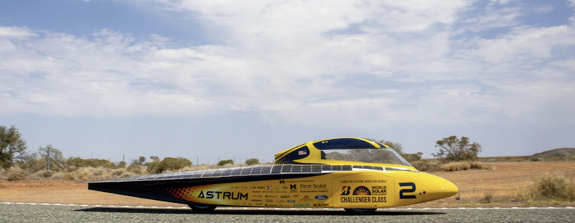
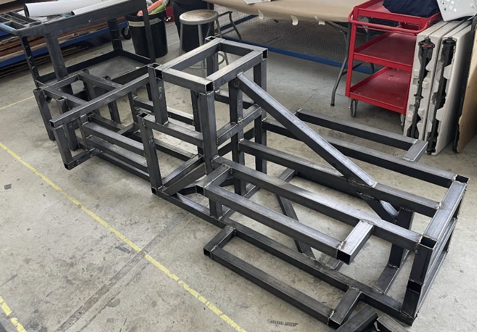
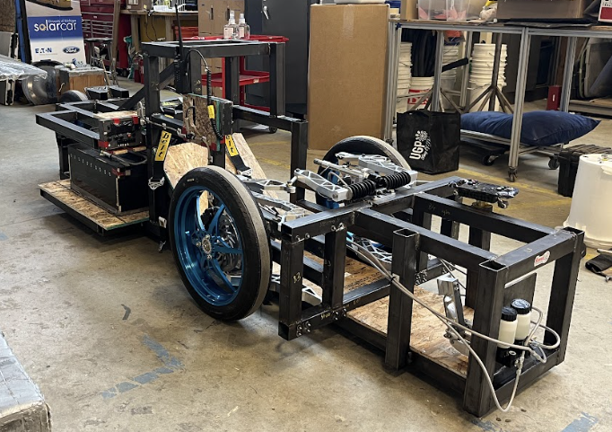
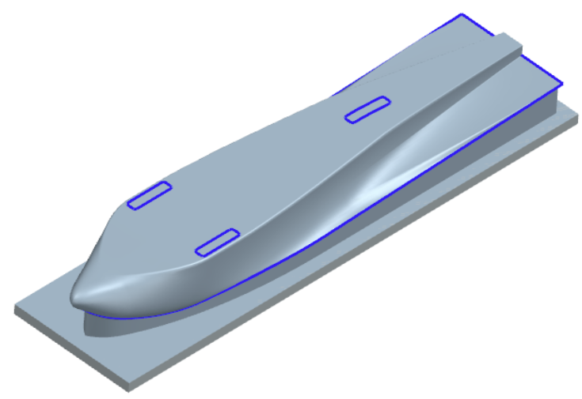

  

## Axle Optimization
The axle on the 2023 Solar Car (Astrum) was optimized to reduce mass and deflection while prioritizing minimizing bearing resistance. Analysis of the stress and deflection of the axle under 3 load cases was done through ANSYS, also exploring different axle geometries and materials. This analysis will inform the design of the 2025 Solar Car axle as cell as its impact on race time vs cost.

## Mule Car Chassis
The creation, design and manufacturing of the Mule Car Chassis on the Solar Car team was completed in a 2 week span for the Mechanical and Electrical Divisions to test their systems and components. I created the CAD design and ran beam-bending hand calcs as well as FEA to meet safety regulations and safety factor of 1.5. I also complied a BOM and coordinated the manufacturing process (welding and waterjet) for the chassis. I had complete ownership of this project as a new member of the team.

  
&nbsp; &nbsp; &nbsp; &nbsp;
  

## Tooling: Initial Upper and Lower Plug Design 
The tooling, initial plugs, for the upper and lower parts of the car was designed in Siemens NX. I communicated with the manufacturer to determine any important features to add to the tooling such as surface finish, split lines and mold lines. Additionallu, I researched optimal tooling board density and plug to mold composite manufacturing process for a better surface finish.

  

